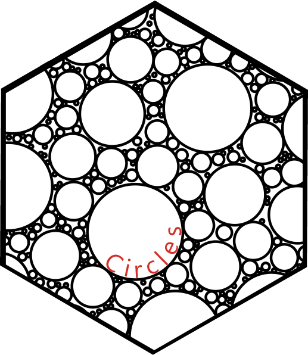
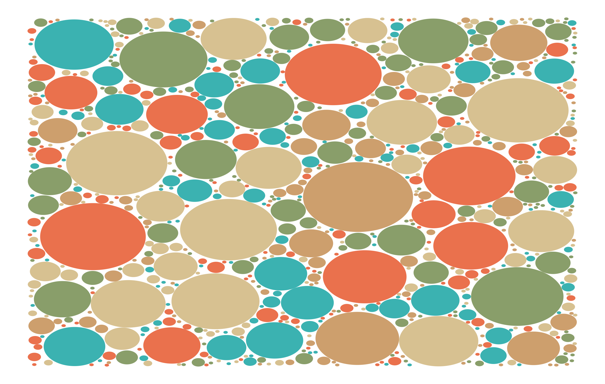

# circles
 An R package for creating circles
 
  <!-- badges: start -->
[](https://CRAN.R-project.org/package=circles)
[](https://lifecycle.r-lib.org/articles/stages.html#experimental)
[](https://github.com/ryan-odea/circles/actions/workflows/R-CMD-check.yaml)
  <!-- badges: end -->
<br> 
## Description
A small package for drawing circles. Currently only supporting the `bubblebath` and `draw_circle` functions which creates a series of radii, emulating matlab's `bubblechart` function, and creates data for path or polygon plotting respectively.

## Examples
```r
library(circles); library(ggplot2); library(data.table)
# Create data
data <- bubblebath()
plotting_data <- draw_circle(data)

# Bind Fill aesthetic 
setDT(plotting_data)

data[, col := as.factor(sample(1:5, .N, replace = TRUE)), by = "group"]

# Plot
ggplot(data, aes(x = x, y = y, group = group, fill = col)) + 
  geom_polygon(alpha = 0.8) + 
  scale_fill_manual(values = wesanderson::wes_palette("AsteroidCity1")) + 
  theme_void() + 
  guides(fill = "none")
```
<p align="center">  </p>
